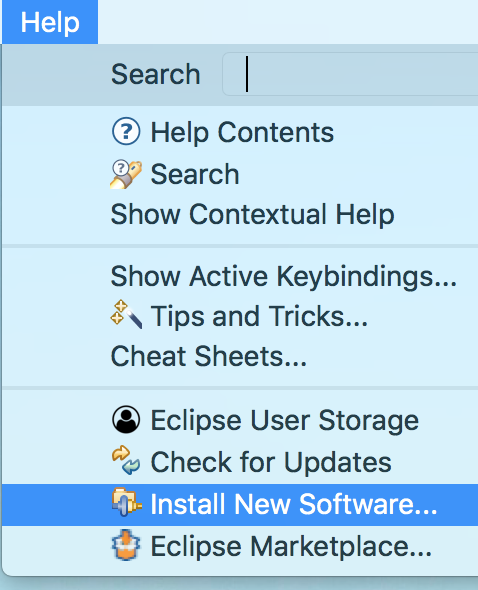
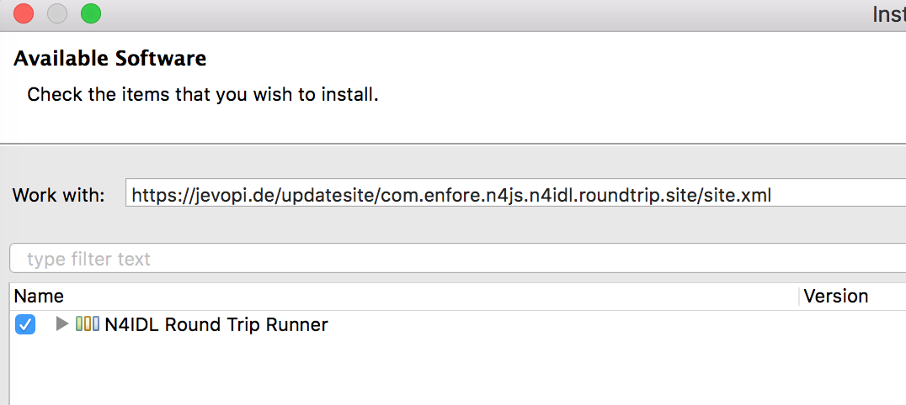
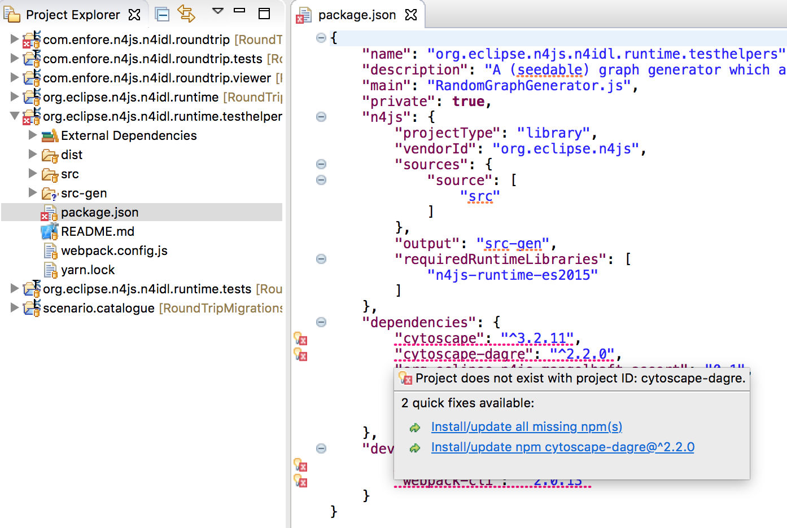
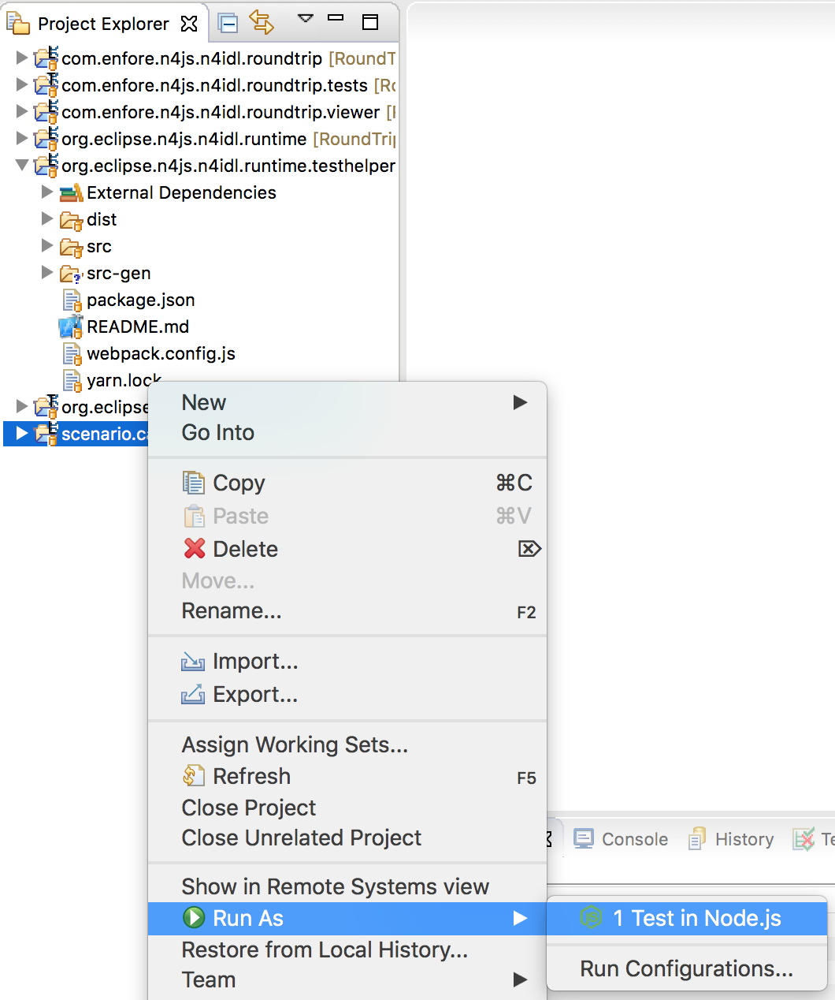
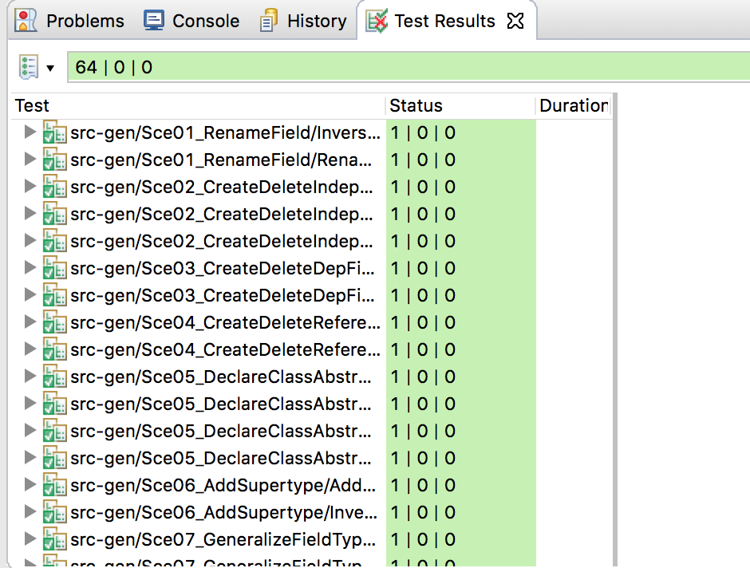
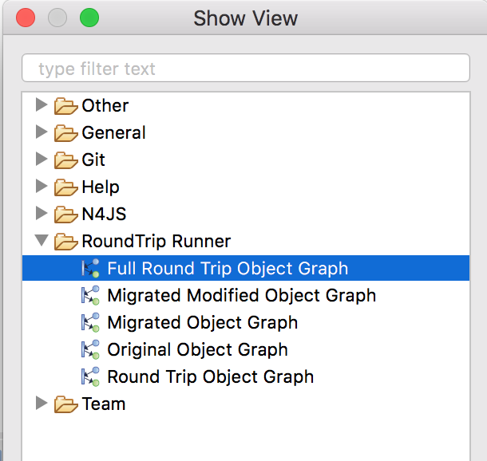
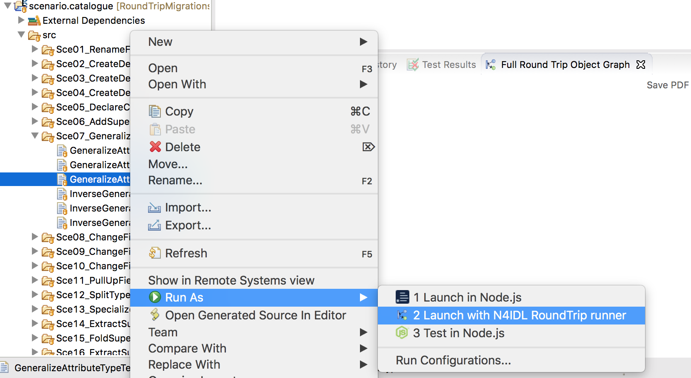
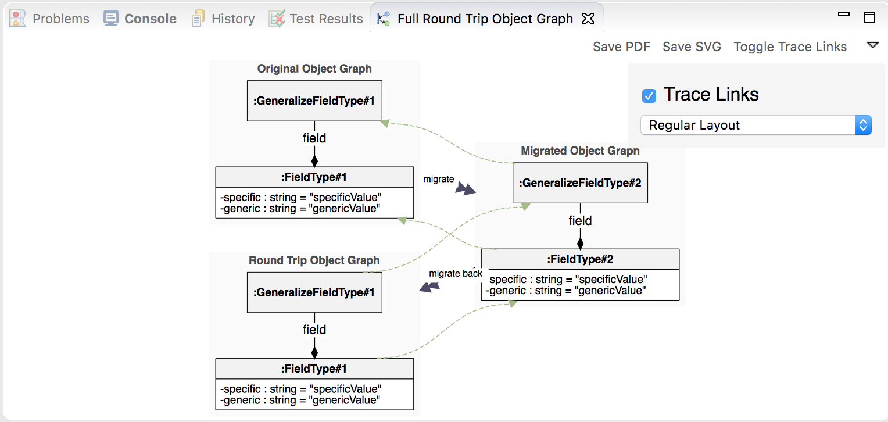

# Supplementary Material for the paper Towards Versioned Service APIs and Round-Trip Migration of Data Model Instances

The round-trip migration catalogue was developed by Luca Beurer-Kellner as part of his bachelor thesis. It is available here:

- [https://www.informatik.hu-berlin.de/de/forschung/gebiete/mse/Abschlussarbeiten/Abgeschlossen/bachelorkelner](https://www.informatik.hu-berlin.de/de/forschung/gebiete/mse/Abschlussarbeiten/Abgeschlossen/bachelorkelner)

The thesis contains a details description of the 22 round-trip scenarios.

## Requirements

You need the following software to be installed on your machine:

- Java 12 [Oracle Download](https://www.oracle.com/technetwork/java/javase/downloads/jdk12-downloads-5295953.html) or [OpenJDK](https://openjdk.java.net/install/))
- Node.js (https://nodejs.org, version 12 recommended)
- Yarn Package Manager (https://yarnpkg.com/lang/en/docs/install, version 1.16.0 recommended)

Furthermore you need the Eclipse N4JS IDE for executing the migrations. Nightly builds of the IDE can be found here:

- [https://projects.eclipse.org/projects/technology.n4js/downloads](https://projects.eclipse.org/projects/technology.n4js/downloads)

Download the IDE for your OS, extract the archive and run the IDE.


### Additional Tool Support

Additionally you may install the plugins found in the folder "roundtrip-runner" on the `update-site` branch. They provide a designated runner for round-trip migration scenarios and a view for showing corresponding object diagrams. This is explained in the appendix of the thesis mentioned above.

After launching the Eclipse IDE, go to Help/Install New Software.



Enter a new update site:

```
https://jevopi.de/updatesite/com.enfore.n4js.n4idl.roundtrip.site/site.xml
```

Select the Round-Trip Runner and install it.



## Import Projects

Go to File / Import ... and select "Projects from Git" and "Clone URI".
Use this repository, i.e. use

```
https://github.com/jpilgrim/RoundTripMigrations.git
```

as the URI.

Select the master branch and select all projects on the "Import Projects" wizard page.


## Run Tests

The scenario catalogue is given as a set of N4IDL declarations and corresponding test suites, asserting the discussed migration properties.

### Install missing dependencies

After importing the projects, you will get compiler errors due to missing dependencies. 
In order to resolve all dependencies, open a package.json file with errors and choose quickfix "Run 'npm/yarn install' in all projects" (by hovering over the error message of any dependency). Alternatively you can run the tool "Install  missing dependencies" (button with two gears found in the toolbar).



### Run the Scenario Tests

In order to run all tests of the catalog, right-click the project “scenario.catalog” and select “Run As / Test in Node.js”. 



You will then see a JUnit-like view presenting test report.



### Use the Round-Trip Viewer

If you installed the additional round-trip migration tooling, you can also visualise round-trip migrations. In order to view the object graph including the traces and migrations, go to Window / Show View / Other and select the RoundTip Runner / Full Round Trip Object Graph.




For any test in the `scenario.catalogue` project (i.e., an N4IDL file which file name as a suffix "Test"), use the context menu (right-click on the file) and select "Run As / Launch with N4IDL Roundtrip runner".



You will then see the object graph in the viewer.



# License

The content found in this project is made available under the Eclipse Public License 2.0.
